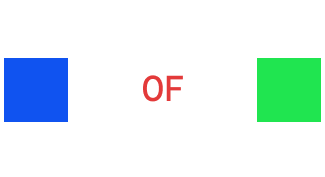
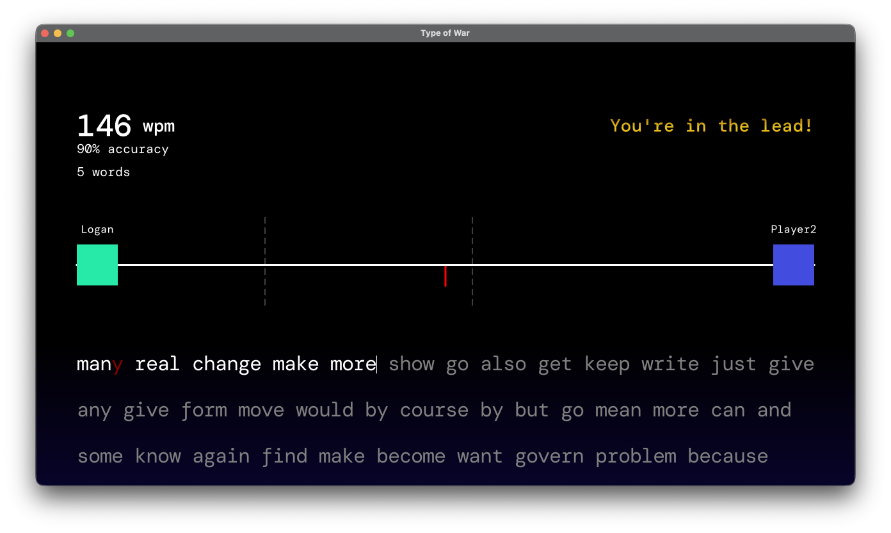
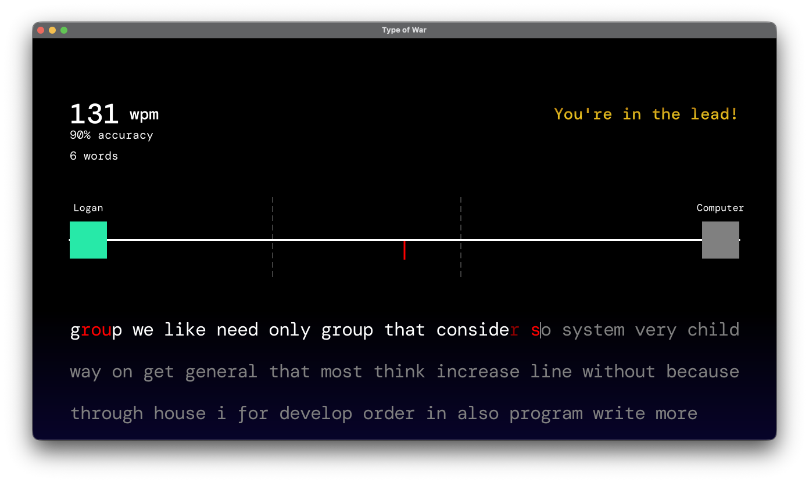
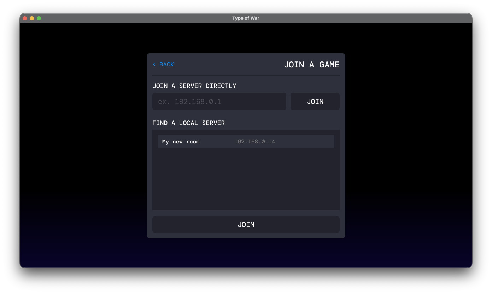
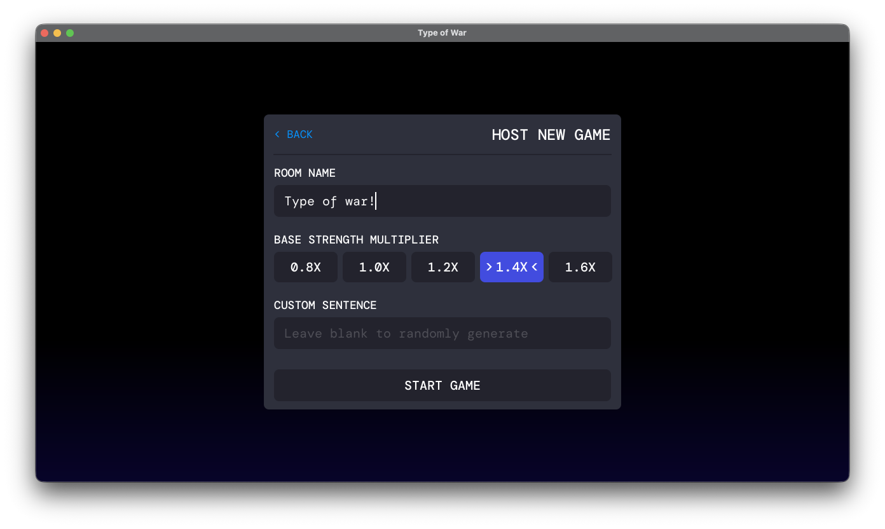

# Type of War

<p align="center">

</p>

Type of War is a real-time typing strategy game built on a custom Java game engine.
Players compete by typing quickly and accurately to gain an advantage over opponents.

The game supports both single-player practice and multiplayer matches with up to 8 players.

## Gameplay Overview

Type of War combines fast-paced typing with competitive strategy.
Players race to complete words and phrases faster than their opponents to gain progress and win rounds.

<p align="center">
  
</p>


Screenshot guidance (gameplay.png):
•	Mid-round gameplay
•	Words visible
•	Progress bars / scores visible
•	No debug overlays

## Game Modes

### Singleplayer (Practice)

Practice against a computer-controlled opponent to improve speed and accuracy.

<p align="center">
  
</p>

### Multiplayer

Compete in real-time matches with up to 8 players.

<p align="center">
  
</p>

Control every aspect of your matches.

<p align="center">
  
</p>


## Technology Stack
•	Java 21
•	Gradle 8
•	JavaFX – rendering and UI
•	Google Protocol Buffers – networking and serialization
•	Log4j – logging
•	Custom Game Engine – core architecture and systems

The game is built on a heavily customized in-house engine rather than a standard framework.

## Requirements
•	JDK 21
•	Gradle 8 (or Gradle Wrapper)

## How to Use

Just start the program using Gradle!

```shell
$ ./gradlew run
```

Ensure `JAVA_HOME` points to JDK 21.

## Project Structure

engine/     Custom game engine
game/       Game logic and scenes
network/    Multiplayer + protobuf
ui/         JavaFX UI


## Multiplayer Notes
•	Supports up to 8 concurrent players
•	Uses Protocol Buffers for communication
•	Requires a host/server instance

# License

&copy; 2025 All rights reserved. Do not distribute! License is subject to change.